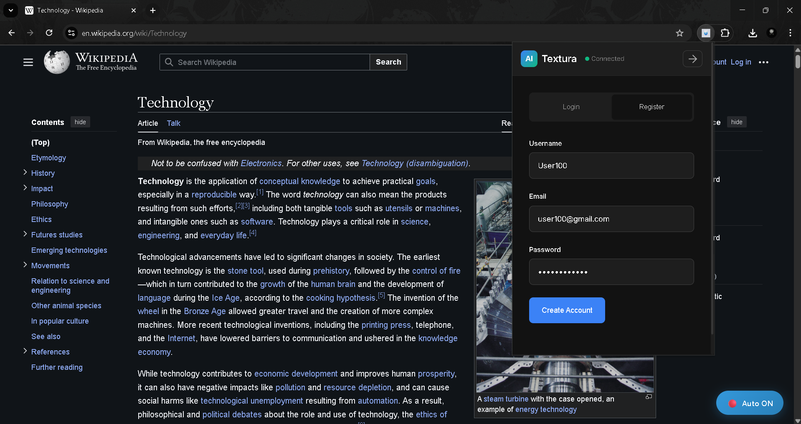
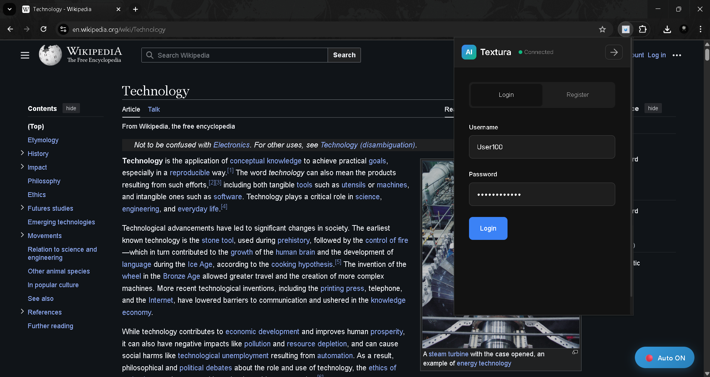
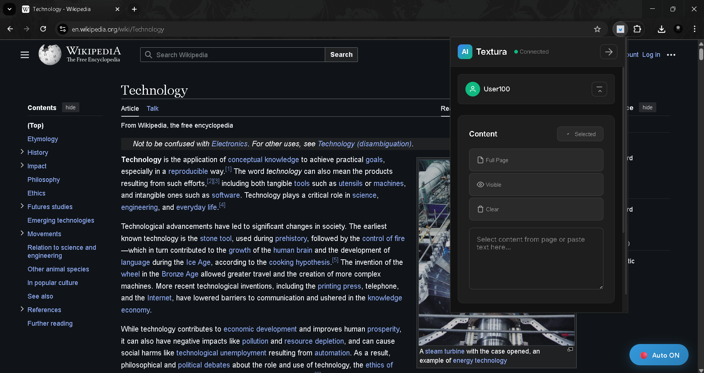
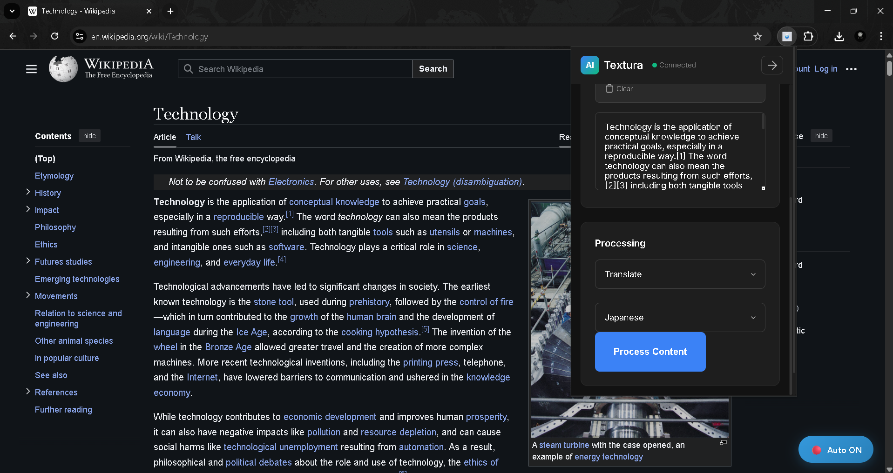
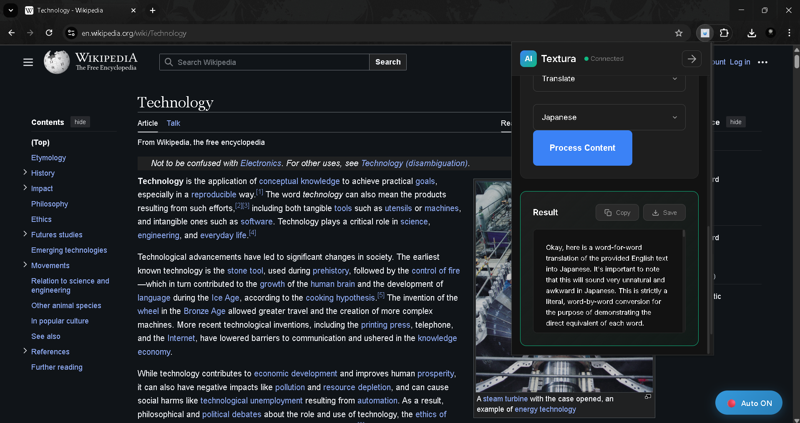
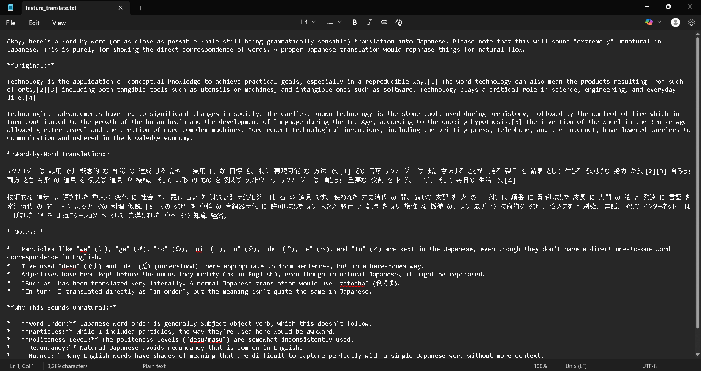
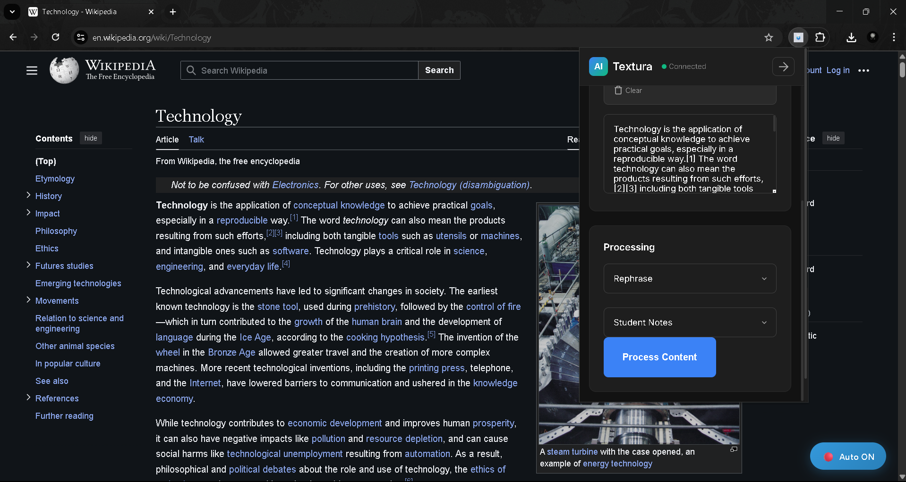
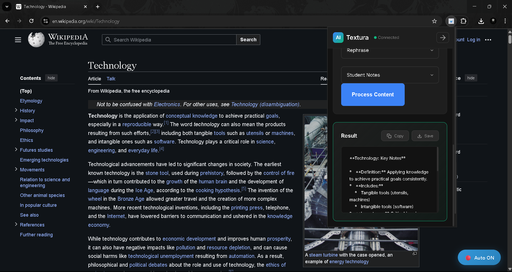
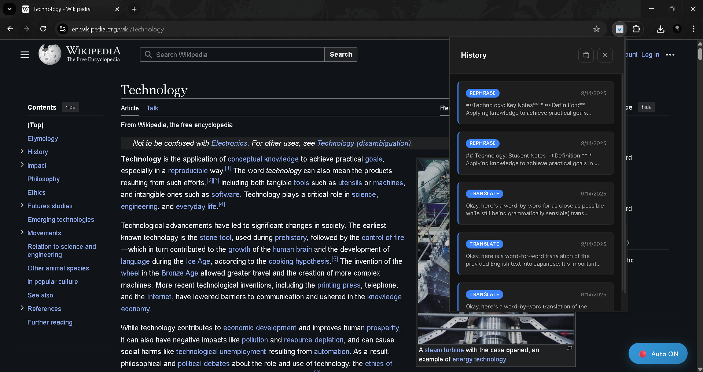
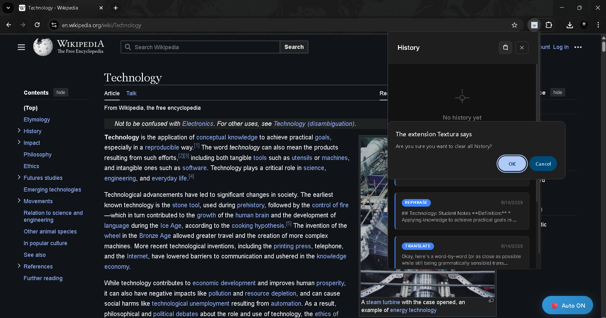

[README.md](https://github.com/user-attachments/files/22120369/README.md)

# Textura-ai

Textura is a comprehensive web application consisting of a Chrome browser extension and a robust Spring Boot backend API. This project enables users to process any text content on the web using advanced AI capabilities, with features including automatic text summarization, translation, rephrasing, and data extraction.

Problem Statement

In today's information-rich digital environment, users frequently encounter large amounts of text content that requires processing, analysis, or transformation. Traditional copy-paste workflows are inefficient and time-consuming.
Solution
Textura provides a seamless, one-click solution that:

Automatically detects text selection on any webpage
Processes content using Google's Gemini AI
Stores results securely with user authentication
Provides instant access to processed content across sessions

Target Audience

Students & Researchers: Quick summarization of academic papers and articles
Content Creators: Rephrasing and translation for global audiences
Business Professionals: Meeting notes extraction and document analysis
Language Learners: Translation and simplified text generation
Developers: JSON data extraction from unstructured content

Technical Highlights

Frontend: Chrome Extension (Manifest V3) with modern JavaScript
Backend: Spring Boot 3.5.4 with enterprise security patterns
Database: MySQL with optimized schemas and indexing
AI Integration: Google Gemini API for natural language processing
Security: JWT authentication, BCrypt hashing, account protection
Docker: Containerized and packaged the complete backend service with Docker, leveraging best-practice image layering, reproducible builds, and deploy-ready configurations for cloud environments.

✨ Features

    Intelligent Text Processing

Auto-Detection: Simply select text on any webpage - no clicks needed
Smart Selection: Double-click to auto-expand to full sentences and paragraphs
Real-Time Processing: Get AI results in under 3 seconds with visual feedback
Floating UI: Non-intrusive tooltip and result popups that adapt to page layout
Keyboard Shortcuts: Ctrl+Shift+S for quick summarize, Ctrl+Shift+A for toggle

## About






















## Features

### Password Security & User Isolation

BCrypt Hashing (Strength 12): Every user password is securely hashed using BCrypt with 2¹² iterations, ensuring maximum resistance against brute-force and rainbow table attacks.

User Isolation: Each account operates in complete isolation, guaranteeing that personal data and content remain fully segregated. Coupled with role-based access control, this ensures only authorized users can perform sensitive operations.

Session Management: Advanced token-based authentication manages sessions seamlessly, with automatic token refresh to prevent timeouts and a secure logout mechanism to safeguard user data.

Input Validation: Comprehensive protection against XSS, SQL injection, and other malicious inputs ensures data integrity and application security at every interaction.


### Advanced Data Management

Personal Library: Every processed summary is automatically saved to your account, creating a persistent, organized repository of your content.

Smart Search: Powerful full-text search across all summaries, featuring keyword highlighting for quick identification of relevant content.

Advanced Filtering: Effortlessly filter data by operation type, date range, or source URL, giving users granular control over their content.

Export Options: Copy summaries directly to the clipboard or export in various formats for seamless integration with other tools.

Analytics Dashboard: Gain actionable insights through personal statistics, tracking trends in processing activity, popular operations, and usage patterns.

Batch Operations: Perform bulk actions on multiple summaries simultaneously, streamlining workflow and enhancing efficiency.

### User Experience & Interface

Responsive Design: Fully optimized for all devices and browsers, providing a smooth experience whether on desktop, tablet, or mobile.

Accessibility: Designed with ARIA labels, full keyboard navigation, and screen reader compatibility to ensure inclusivity for all users.

Multi-language UI: Supports 10+ languages, allowing users to operate the extension in their preferred language.

Customizable Settings: Tailor processing delays, default operations, and other preferences to match individual workflow needs.

Offline Mode: Core functionality remains available even without an internet connection, ensuring productivity anytime, anywhere.

## Development Setup

# Backend

    git clone https://github.com/Key-to-Code/textura-ai.git

    cd textura-ai

    mvn clean install


#FrontEnd

    cd extension

#Load unpacked extension in Chrome
# Chrome Extension

## Install extension files
extension/

├── manifest.json

├── content.js

├── content.css

├── popup.html

├── popup.css

├── popup.js

└── background.js


# Load in Chrome
1. Go to chrome://extensions/

2. Enable "Developer mode"

3. Click "Load unpacked"

4. Select extension folder
## API Reference

#### SETUP IN POSTMAN


1. Login User
POST https://generativelanguage.googleapis.com/v1beta/models/gemini-2.0-flash:generateContent?key=GEMINI_kEY

| Parameter | Type   | Description            |
| --------- | ------ | ---------------------- |
| GEMINI_KEY        | string |  |


Body (JSON):

    {

    "contents":
    
     [

      {

        "parts":
        
         [

          {

            "text": "Explain how AI works in a few words"

          }

        ]

      }

    ]

    }


2. Health Check (No Authentication Required)

GET http://localhost:8080/api/test/health

| Parameter | Type | Description            |
| --------- | ---- | ---------------------- |
| None      | —    | No parameters required |

Expected Response:

{

  "status": "UP", 

  "service": "Chrome Extension Assistant"

}

3. Test Connections (No Authentication Required)

GET http://localhost:8080/api/test/connections

| Parameter | Type | Description            |
| --------- | ---- | ---------------------- |
| None      | —    | No parameters required |

Expected Response:

{

  "gemini": true,
  
  "database": "Connected",
  
  "overall": true

}

4. Register a New User
POST http://localhost:8080/api/auth/register

| Parameter | Type   | Description      |
| --------- | ------ | ---------------- |
| username  | String | Desired username |
| email     | String | User email       |
| password  | String | Strong password  |


Body (JSON):

{
  
  "username": "testuser",
  
  "email": "test@example.com",
  
  "password": "TestPass123!"

}


Expected Response:

{

  "message": "User registered successfully!"

}

5. Login User
POST http://localhost:8080/api/auth/login

| Parameter | Type   | Description         |
| --------- | ------ | ------------------- |
| username  | String | Registered username |
| password  | String | User password       |


Body (JSON):

{
  
  "username": "testuser",
  
  "password": "TestPass123!"
}


Expected Response:

{
  
  "token": "eyJhbGciOiJIUzI1NiIsInR5cCI6IkpXVCJ9...",
  
  "type": "Bearer",
  
  "userId": 1,
  
  "username": "testuser",
  
  "email": "test@example.com"

}


⚠️ Important: Copy the token for the next authenticated requests.

6. Process Content (Requires Authentication)
POST http://localhost:8080/api/assistant/process

| Parameter      | Type   | Description                                          |
| -------------- | ------ | ---------------------------------------------------- |
| content        | String | Text to process                                      |
| operation      | String | Operation type: summarize-short, translate, rephrase |
| sourceUrl      | String | Original content URL                                 |
| sessionId      | String | Session identifier (optional)                        |
| targetLanguage | String | (For translate only) Target language code            |
| rephraseTone   | String | (For rephrase only) Tone: easy/medium/hard           |


Headers:

Content-Type: application/json
Authorization: Bearer YOUR_JWT_TOKEN_HERE


Example Body (Summarize):

{

  
  "content": "Artificial intelligence (AI) is intelligence demonstrated by machines...",
  
  "operation": "summarize-short",
  
  "sourceUrl": "https://google.com/ai-article",
  
  "sessionId": "session-123"

}


Expected Response:

{

  
  "success": true,
  
  "message": "Content processed and saved successfully!",
  
  "data":   
  
    {

            "summaryId": 1,
            
            "processedContent": "AI is machine intelligence that perceives environments and takes goal-maximizing actions...",
            
            "operation": "summarize-short",
            
            "userId": 1,
            
            "createdAt": "2025-08-31T10:30:00"
    }

}

7. Get User Summaries (Requires Authentication)
GET http://localhost:8080/api/summaries

| Parameter | Type   | Description                              |
| --------- | ------ | ---------------------------------------- |
| operation | String | Optional filter by operation type        |
| days      | Number | Optional, get summaries from last N days |
| search    | String | Optional, search keyword                 |


Headers:

Authorization: Bearer YOUR_JWT_TOKEN_HERE


Expected Response:

[

    {
    
    "id": 1,
    
    "originalContent": "Artificial intelligence (AI) is intelligence...",
    
    "processedContent": "AI is machine intelligence that perceives...",
    
    "operation": "summarize-short",
    
    "sourceUrl": "https://example.com/ai-article",
    
    "sessionId": "session-123",
    
    "createdAt": "2025-08-31T10:30:00",
    
    "updatedAt": "2025-08-31T10:30:00"

    }

]

8. Get Specific Summary (Requires Authentication)
GET http://localhost:8080/api/summaries/1

| Parameter | Type   | Description            |
| --------- | ------ | ---------------------- |
| id        | Number | Summary ID to retrieve |


Headers:

Authorization: Bearer YOUR_JWT_TOKEN_HERE


Expected Response:

{
  
  "id": 1,
  
  "originalContent": "Artificial intelligence (AI) is intelligence...",
  
  "processedContent": "AI is machine intelligence that perceives...",
  
  "operation": "summarize-short",
  
  "sourceUrl": "https://example.com/ai-article",
  
  "createdAt": "2025-08-31T10:30:00"

}

9. Get User Statistics (Requires Authentication)
GET http://localhost:8080/api/summaries/stats

| Parameter | Type | Description   |
| --------- | ---- | ------------- |
| None      | —    | No parameters |


Headers:

Authorization: Bearer YOUR_JWT_TOKEN_HERE


Expected Response:

{

  "totalSummaries": 5,
  
  "recentSummaries": 3,
  
  "username": "testuser",
  
  "memberSince": "2025-08-31T09:15:00"

}

10. Delete Summary (Requires Authentication)
DELETE http://localhost:8080/api/summaries/1

| Parameter | Type   | Description          |
| --------- | ------ | -------------------- |
| id        | Number | Summary ID to delete |


Headers:

Authorization: Bearer YOUR_JWT_TOKEN_HERE


Expected Response:

{

  "message": "Summary deleted successfully"

}


## Authors

- [@Key-to-Code](https://www.github.com/Key-to-Code)


## Environment Variables

To run this project, you will need to add the following environment variables to your Intellij

`GEMINI_KEY`

`JWT_SECRET`

`DB_USERNAME:root`

`DB_PASSWORD:password`


## Deployment

To deploy this project run

```# 
# Install dependencies and run tests
  mvn clean install

# Start application (development)
  mvn spring-boot:run

# Application will start on http://localhost:8080

```


## Spring Boot Backend Architecture

Backend/

├── 📂 controller/       # REST API endpoints

│   ├── AuthController.java

│   ├── AssistantController.java

│   └── SummaryController.java

├── 📂 service/          # Business logic layer

│   ├── AuthService.java

│   ├── AssistantService.java

│   └── SummaryService.java

├── 📂 entity/           # JPA entities

│   ├── User.java

│   └── Summary.java

├── 📂 repository/       # Data access layer

│   ├── UserRepository.java

│   └── SummaryRepository.java

├── 📂 config/           # Configuration classes

│   ├── SecurityConfig.java

│   └── WebConfig.java

├── 📂 dto/              # Data transfer objects

├── 📂 util/             # Utility classes

│   └── JwtUtils.java

└── 📂 filter/           # Security filters

      └──   JwtAuthenticationFilter.java
    
## Database Schema

-- Users table with security features

    CREATE TABLE users (
    id BIGINT AUTO_INCREMENT PRIMARY KEY,
    username VARCHAR(50) UNIQUE NOT NULL,
    email VARCHAR(100) UNIQUE NOT NULL,
    password VARCHAR(255) NOT NULL, -- BCrypt hashed
    is_enabled BOOLEAN DEFAULT TRUE,
    is_account_non_expired BOOLEAN DEFAULT TRUE,
    is_account_non_locked BOOLEAN DEFAULT TRUE,
    is_credentials_non_expired BOOLEAN DEFAULT TRUE,
    failed_login_attempts INT DEFAULT 0,
    account_locked_until TIMESTAMP NULL,
    last_login TIMESTAMP NULL,
    created_at TIMESTAMP DEFAULT CURRENT_TIMESTAMP,
    updated_at TIMESTAMP DEFAULT CURRENT_TIMESTAMP ON UPDATE CURRENT_TIMESTAMP,
    INDEX idx_username (username),
    INDEX idx_email (email),
    INDEX idx_created_at (created_at));

-- Summaries table with full-text search


    CREATE TABLE summaries 
    (id BIGINT AUTO_INCREMENT PRIMARY KEY,
    user_id BIGINT NOT NULL,
    original_content TEXT NOT NULL,
    processed_content TEXT NOT NULL,
    operation VARCHAR(50) NOT NULL,
    target_language VARCHAR(50),
    rephrase_tone VARCHAR(50),
    source_url TEXT,
    user_agent TEXT,
    session_id VARCHAR(100),
    created_at TIMESTAMP DEFAULT CURRENT_TIMESTAMP,
    updated_at TIMESTAMP DEFAULT CURRENT_TIMESTAMP ON UPDATE CURRENT_TIMESTAMP,

    FOREIGN KEY (user_id) REFERENCES users(id) ON DELETE CASCADE,
    INDEX idx_user_id (user_id),
    INDEX idx_operation (operation),
    INDEX idx_created_at (created_at),
    FULLTEXT idx_content_search (original_content, processed_content);


## Acknowledgements

 - [Gemini API](https://ai.google.dev/)
 - [Postman](https://www.postman.com/)
 - [Spring boot](https://spring.io/projects/spring-boot)
 - [Intellij](https://www.jetbrains.com/idea/)

